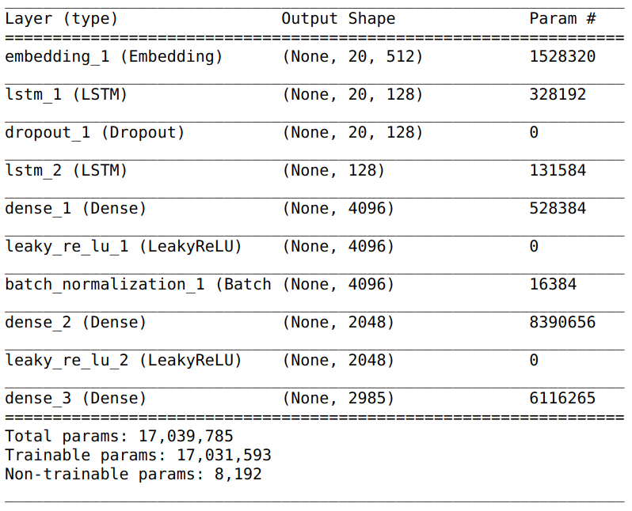

# next-word-predictor
Predicting what word comes next with Tensorflow. Implement RNN and LSTM to develope four models of various languages.

## Project Intro
The purpose of this project is to train next word predicting models. Models should be able to suggest the next word after user has input word/words. Four models are trained with datasets of different languages. Python Django as backend and JavaScript/HTML as Frontend.

### Methods Used
* Language Prediction
* Natural Language Processing
* RNN, LSTM

### Technologies
* Python
* Python Django
* Tensorflow, Keras
* Js, HTML

## Project Description
* `model-training` - files to train models
* `nextwordpredictor` - Django application, loads trained models

Data are from following sources:
1. English - [blogger.com](http://u.cs.biu.ac.il/~koppel/BlogCorpus.htm)
2. Malay - [github](https://github.com/huseinzol05/Malaya-Dataset)
3. Chinese - [tsinghua](http://thuctc.thunlp.org/)
4. Malaysian Twitter tweets

## Process Flow
- frontend development
- data collection
- data processing/cleaning
- words tokenizing
- model training
- writeup/reporting

## Getting Started

### Prerequisites
Install python dependencies via command
`pip install -r requirements.txt`

1. Start server via command `python3 manage.py runserver` from the nextwordpredictor/ directory and navigate to `http://127.0.0.1:8000/index`.

## Contributing Members

|Name     |
|---------|
| Lim SW |
| Leanne |
| Wilson |
